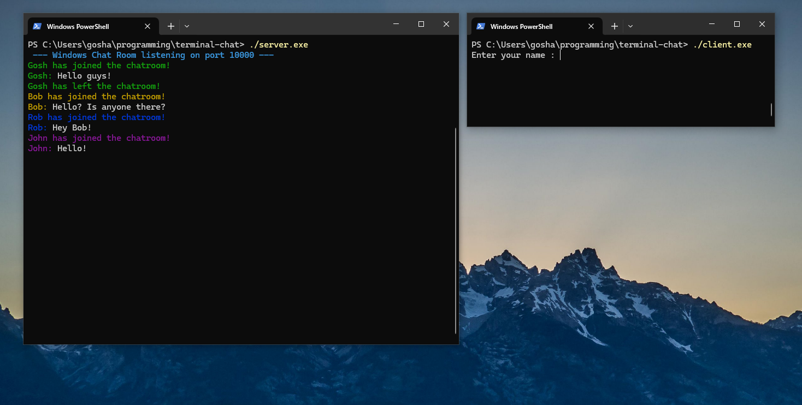

# Windows Terminal Chat

A minimal chat room written in modern **C++17** on top of **Winsock 2** using **socket programming** and **multi-threading**. Everything runs in a Windows console and uses ANSI escape sequences for coloured nicknames.

---

## Quick Preview

<p align="center">
  
</p>

## Build

### MinGW‑w64 / MSYS2

```bash
# Server
g++ -std=c++17 -Wall -pthread server.cpp -o server.exe -lws2_32

# Client
g++ -std=c++17 -Wall client.cpp -o client.exe -lws2_32
```

## Run

1. Launch the server in one terminal:
   ```cmd
   server.exe
   ```
2. Open additional terminals and start as many clients as you would like:
   ```cmd
   client.exe
   ```
3. Type your messages and watch them pop up in chat. Type #exit to leave the chat

## Files

- `common.hpp` - ANSI helpers and colour picker  
- `server.cpp` - Multithreaded chat server (one thread per client)  
- `client.cpp` - Lightweight terminal client  
